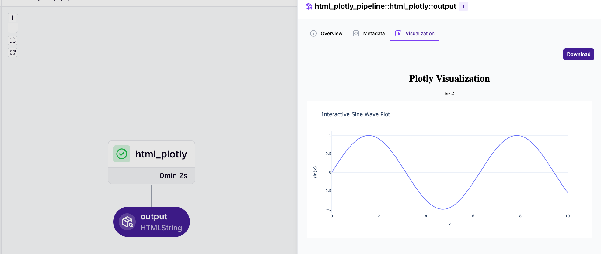
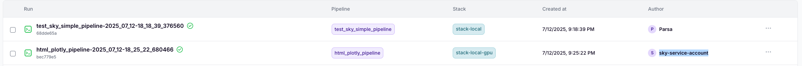

# Getting Started

This example demonstrates the implementation of Small Language Model Operations (SLMOps) based on our [thesis research](https://github.com/LMOrbits/thesis). The implementation follows an iterative development approach inspired by the [SLMOps paper](https://arxiv.org).

Follow these steps to get started:

## 1. Set Up the Environment

- Configure your infrastructure environment following the [infrastructure guide](getting-started/infra/README.md). We recommend using the cloud-based deployment option, since the local deployment is not fully supported yet for fine-tuning the model.
- Ensure all prerequisites are installed and configured properly

## 2. Set up the orchestration:

### Set up the orchestration:

the documention for the orchestration is in the [orchestration](../how-to/development/lmorbits/ORCHESTRATION/README.md) folder. but here is a quick start guide for it to start with or simple example:

#### 1. Make sure you cloned the lmorbits reposirtory:

```bash
gh repo clone LMOrBits/lmorbits
cd lmorbits
```

#### 2. Set up the orchestration(zenml):

```bash
cd packages/orchestration
uv sync
uv run task zenml:zenml-init
```

this will authenticate you with the zenml server and set up the zenml client.

then making sure we have installed the reguired integrations for the zenml:

```bash
uv run task zenml:setup:all-integrations
```

this will install the required integrations for the zenml.

#### 3. Set up the stacks that are required for the orchestration:

we will setup 3 stacks for the orchestration:

```bash
uv run task zenml:setup:local-gcs
uv run task zenml:setup:local-gpu-gcs
uv run task zenml:setup:all-k8s
```

#### 4. now is the time to test the pipeline:

```bash
uv run task zenml:test:plot
```

this will test the pipeline and plot the results. and it show you the link afterwards, if it goes well. and then you can go to the link and see the results as in the image below:


### now we need to create a accounts for people that would work with the orchestration or resources:

```bash
uv run task zenml:setup:create-users
```

this will create a accounts for people that would work with the orchestration or resources.
and then you can use the accounts to login to the zenml server and start working with the orchestration.
and then you can use the accounts to login to the zenml server and start working with the orchestration.

one more thing to do is to create a service account for the orchestration specially to use it via skypilot when we utilizing a gpu , you can do it manually via ui in zenmlui > setting > service accounts > create service account.
or via the cli:

```bash
uv run task zenml:setup:create-service-account
```

this will create a service account for the orchestration.
make sure that you store the generated the api keys in the .env in the lmorbits/.env file
`SKY_ZENML_STORE_API_KEY = <your_api_key>`
`SKY_ZENML_STORE_URL = <your_url>`

this way from now on your skypilot instances will have access to the orchestration and resources.
make sure the api has to be one line

now you can test it by :

```bash
uv run task zenml:test:skypilot
```

this will create a pipeline (e.i. test_sky_simple_pipeline) in which in this pipline it will create a skypilot instance and then run a new pipeline in that instance (e.i. html_plotly_pipline same as test which was our intention to test the pipeline in the skypilot instance that we initiated with our piplines). As you can see in the image below , the html_plotly_pipline will be run in the skypilot instance as the author of it is the skypilot instance.


#### 5. now we set up the lakefs instace:

go to your lakefs address and start it by providing your name and email and get the keys from there and fill the .env.example file into a .env file in the orchestration folder. this will allow us to handle the data piplines.
