# SimpleExample

This example demonstrates the implementation of Small Language Model Operations (SLMOps) based on our [thesis research](https://github.com/LMOrbits/thesis). The implementation follows an iterative development approach inspired by the [SLMOps paper](https://arxiv.org).

Follow these steps to get started:

## 1. Set Up the Environment

- Configure your infrastructure environment following the [infrastructure guide](getting-started/infra/). We recommend using the cloud-based deployment option, since the local deployment is not fully supported yet for fine-tuning the model.
- Ensure all prerequisites are installed and configured properly

## 2. Set up the orchestration:

the documention for the orchestration is in the [orchestration](../how-to/development/lmorbits/ORCHESTRATION/) folder. but here is a quick start guide for it to start with or simple example:

### 1. Make sure you cloned the lmorbits reposirtory:

```bash
gh repo clone LMOrBits/lmorbits
cd lmorbits
```

---

### 2. Set up the orchestration(zenml):

```bash
cd packages/orchestration
uv sync
uv run task zenml:zenml-init
```

this will authenticate you with the zenml server and set up the zenml client.

then making sure we have installed the reguired integrations for the zenml:

```bash
uv run task zenml:setup:all-integrations
```

this will install the required integrations for the zenml.

---

### 3. Set up the stacks that are required for the orchestration:

we will setup 3 stacks for the orchestration:

```bash
uv run task zenml:setup:local-gcs
uv run task zenml:setup:local-gpu-gcs
uv run task zenml:setup:all-k8s
```

---

### 4. now is the time to test the pipeline:

```bash
uv run task zenml:test:plot
```

this will test the pipeline and plot the results. and it show you the link afterwards, if it goes well. and then you can go to the link and see the results as in the image below:&#x20;

<div data-full-width="true"><figure><figcaption></figcaption></figure></div>

---

### 5. creating users for the orchestration:

now we need to create a accounts for people that would work with the orchestration or resources:

```bash
uv run task zenml:setup:create-users
```

this will create a accounts for people that would work with the orchestration or resources. and then you can use the accounts to login to the zenml server and start working with the orchestration. and then you can use the accounts to login to the zenml server and start working with the orchestration.

---

### 6. creating a service account for the orchestration:

one more thing to do is to create a service account for the orchestration specially to use it via skypilot when we utilizing a gpu , you can do it manually via ui in zenmlui > setting > service accounts > create service account. or via the cli:

```bash
uv run task zenml:setup:create-service-account
```

this will create a service account for the orchestration. make sure that you store the generated the api keys in the .env in the lmorbits/.env file `SKY_ZENML_STORE_API_KEY = <your_api_key>` `SKY_ZENML_STORE_URL = <your_url>`

this way from now on your skypilot instances will have access to the orchestration and resources. make sure the api has to be one line

now you can test it by :

```bash
uv run task zenml:test:skypilot
```

this will create a pipeline (e.i. test_sky_simple_pipeline) in which in this pipline it will create a skypilot instance and then run a new pipeline in that instance (e.i. html_plotly_pipline same as test which was our intention to test the pipeline in the skypilot instance that we initiated with our piplines). As you can see in the image below , the html_plotly_pipline will be run in the skypilot instance as the author of it is the skypilot instance.

<div data-full-width="true"></div>

---

### 7. now we set up the lakefs instace and :

go to your lakefs address and start it by providing your name and email and get the keys from there and fill the .env.example file into a .env file in the orchestration folder. this will allow us to handle the data piplines.

---

### 8. handle the seceret keys:

now after this we need to create secrets for our lakefs instace e in the zenml secrets manager.

```bash
uv run task zenml:secrets:create-data-secrets
```

you can also check that by

```bash
uv run task zenml:secrets:get-data-secrets
```

it can also be visible in the ui by going to the zenmlui > setting > secrets: 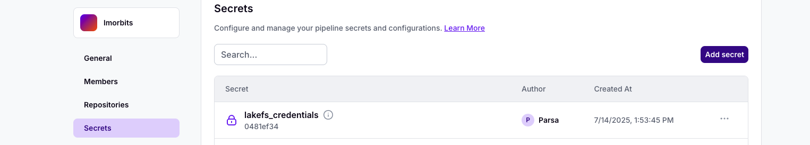

---

### 9. now we can extract data from huggingface based on the config we defined in the orchestration/config/dev/data.yaml file. and move that data into our lakefs instace.

so first we can check which split from what dataset we want to extract, in order to fascilitate the process we can use the following command for getting to konw what splits are available for instace for the dataset named squad_v2 in huggingface:

```bash
uv run task zenml:utils:data:get-splits HF_DATASET_NAME=squad_v2
```

the outcome would be like this:&#x20;

<div data-full-width="true"><figure><figcaption></figcaption></figure></div>

in order to get to know what pipelines we have in the orchestration, you can use the following command:

```bash
uv run pipe dev --help
```

the outcome would be like this:

<div data-full-width="true"><figure><figcaption></figcaption></figure></div>

for instance if you want to run a pipline for huggingface etl you can use the following command:

```bash
uv run pipe dev data-etl-huggingface
```

and if you want to change the config of the pipeline you can use the following command:

```bash
uv run pipe dev data-etl-huggingface --config
```

this will open an vim editor in which you can change the config of the pipeline.

for our example we will use the following command:

```bash
uv run pipe dev silver-hug-etl-elt
```

in order to see what does this pipeline do you can use the following command:

```bash
uv run pipe dev silver-hug-etl-elt --help
```

the outcome would be like this:&#x20;

<div data-full-width="true"><figure>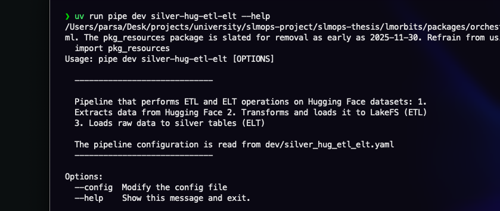<figcaption></figcaption></figure></div>

also you can check the zenml dashborad of cheking the outcome:

<div data-full-width="true"><figure>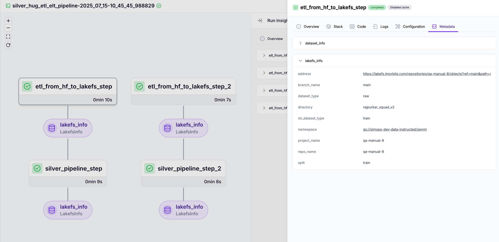<figcaption></figcaption></figure></div>

---

### 10. now we can start to fine tune the model:

as we mentioned before we will use the skypilot instance to fine tune the model. therefor we have 2 configs for the fine tuning process. one is for the skypilot instance and the other is for the model.
the below command will give you access to change the config of the skypilot instance.

```bash
uv run pipe dev sky-finetune-slm --config
```

<div data-full-width="true"><figure>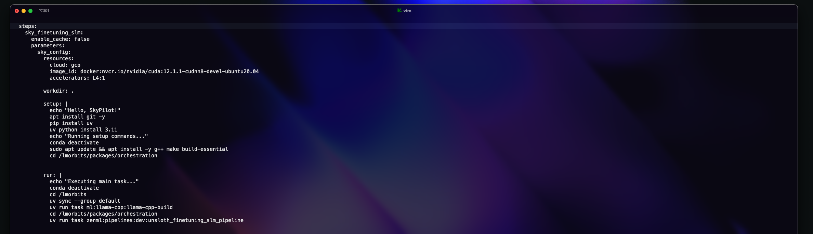<figcaption></figcaption></figure></div>

which under the sky_config you can change the resources of the skypilot instance. and below is the config for the finetune process. which we will use unsloth to fine tune the model. and below you can see the hyperparameters for the finetune process. and also the dataset that will be used for the finetune process. which here we used a dataset directly from huggingface. but you can comment those and uncomment the other one to use the lakefs data if you used the pipline for etl and elt.

<div data-full-width="true"><figure>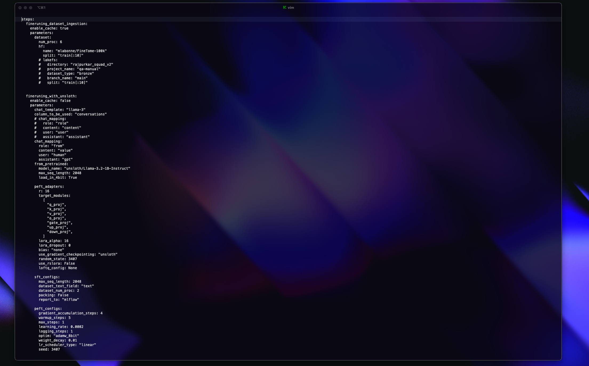<figcaption></figcaption></figure></div>

this will start to train the model.

you can follow up the process in the zenml dashboard that we created a pipeline that boots up a skypilot instance and then fine tunes the model in that instance.

<div data-full-width="true"><figure>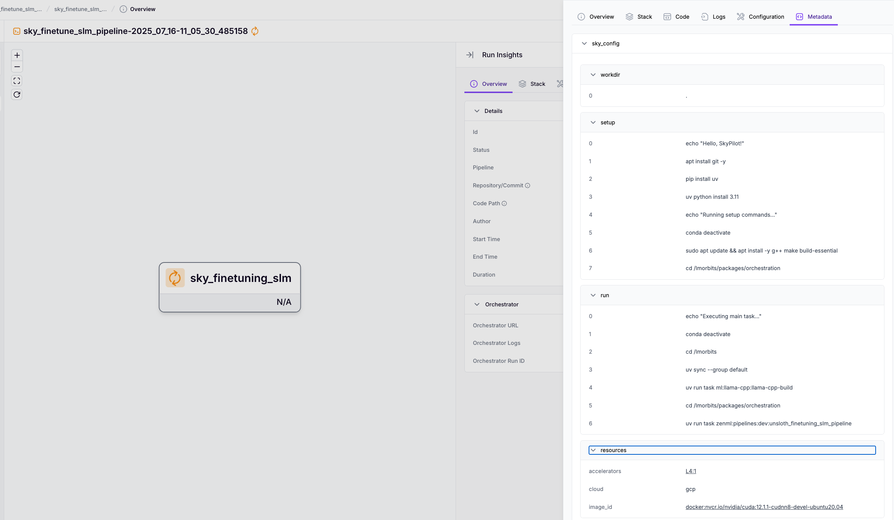<figcaption></figcaption></figure></div>

which undernearh of this pipeline the unsloth_finetune_slm_pipeline would be running. you can also see that in your runs that this pipeline is being triggered by skypilot and is runnign in the skypilot instance. if you click on the stack of it.

<div data-full-width="true"><figure><figcaption></figcaption></figure></div>

here is the pipeline of the unsloth finetune process:

<div data-full-width="true"><figure>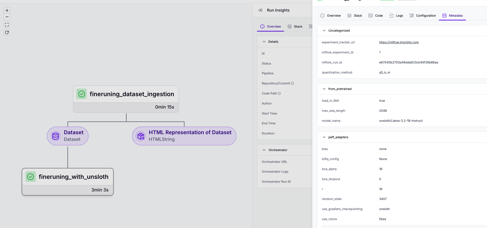<figcaption></figcaption></figure></div>

we do also suppuort the pusing the model to the model registry via the ml package. you can furthure check that in the ml package. under the experiment folder.

### 11. we can also push the embedding model to the model registry via the ml package. or via the zenml pipeline. since we are not yet finetuning the embedding models we can do it easily via a task.

```bash
cd packages/orchestration
uv sync --group ml-embedding-package
uv run task zenml:setup:all-integrations
uv run pipe dev push-model-embedding
```

this will push the embedding model to the model registry. this section is not ideal yet but does the job for now. in the ideal scenario we should be able to push the model via the zenml only.

<div data-full-width="true"><figure>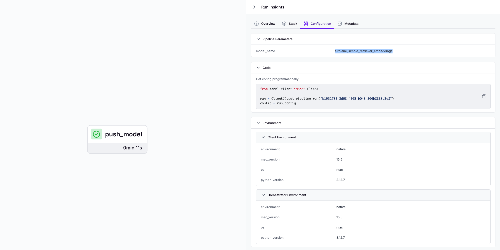<figcaption></figcaption></figure></div>

as you can see we pushed the model to the mlflow.lmorbits.com with and registerd it with the name of ` airplane_simple_retriever_embeddings`

> now that we have our both models we can jump on the app stack and application

### Set up the app stack and application:

> make sure that you have added champion as an alias for your ml models in model registry. or if you selected any other name you need to change the name of the model name in the appdeps.toml of each appstack that we will be shortly going to explain them below.

<div data-full-width="true"><figure>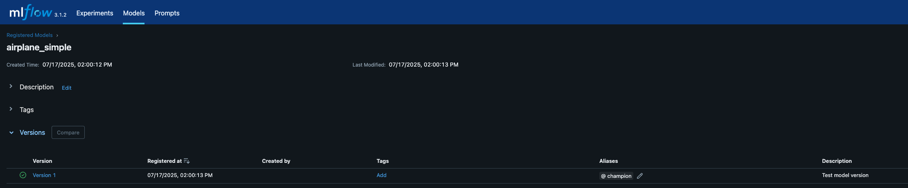<figcaption></figcaption></figure></div>

setting the app stack and starting from templates is yet another story that we will cover in the proper section when we covered the maturiry levels in detail. but here we want to show how we can have them all as an simple example for the airplane app.

in order to do this lets clone the application repo in any directory you want.

```bash
cd <application_directory>
gh repo clone LMOrbits/slmops-application-qa
cd slmops-application-qa/backend
uv run task pyapp-deps-init
```

after this these below directories will be created:

```bash
slmops-application-qa/backend/integrations/airplane_simple_chatbot
slmops-application-qa/backend/integrations/airplane_simple_chatbot/.appdeps/airplane_simple_retriever
```

make sure that you provide a proper appdeps.env based on the appdeps.example.env file.

```bash
cd <application_directory>
cp appdeps.example.env appdeps.env
vi appdeps.env
```

make sure your private keys in the `infra/provision/cloud/terraform/environments/dev/keys/storage-admin-key.json` does not have `\n` in the keys.

> it is worth mentioning that the development of each app stack is something that should be done seperately in their own repos and managed via app_project, but here we will use the sample app to show how we can have them all as an simple example for the airplane app. and since we are not developing stuff there and bypassing some step there are things needs to be done to make it work.

### 1. set up the data for rag system which is the raw data for the airplane app.

```bash
uv run task get-data-from-gist
```

this will download the data from the gist and put it in the `airplane_simple_retriever/data/raw` directory.
now we can push this data to the lakefs instace and this will reside there ( in normal scenario we would have done this while developing the app stack (e.i. airplane_simple_retriever) and it would be automatically be handeled via the appdeps.toml file)

now we can push the data to the lakefs instace.

```bash
cd <application_directory>/slmops-application-qa/backend/integrations/airplane_simple_chatbot/.appdeps/airplane_simple_retriever
uv run pyapp-cli --help
```

now you can see that the pyapp-cli has a lot of commands to help you with the appstack development.

<div data-full-width="true"><figure>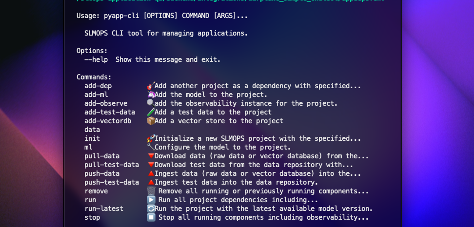<figcaption></figcaption></figure></div>

since we want to push the data to the lakefs instace we can use the following command:

```bash
uv run pyapp-cli push-data
```

this will ask you some questions and then push the data to the lakefs instace.

as you can see from the image below we pushed the data to the lakefs instace.

<div data-full-width="true"><figure>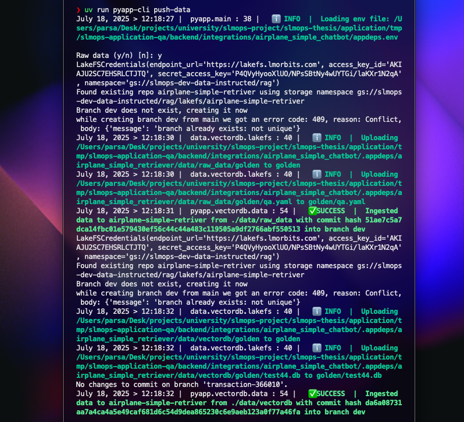<figcaption></figcaption></figure></div>

but this was only the raw data. now we can generate a vectordb as well and push that to the lakefs instace.
in order to do this we can use the following command:

```bash
uv run pyapp-cli generate-vectordb
```

this will ask you some questions and then generate a vectordb and push that to the lakefs instace.

```bash
uv run generate
```

<div data-full-width="true"><figure>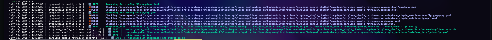<figcaption></figcaption></figure></div>

now we can also push the vectordb to the lakefs instace.

```bash
uv run pyapp-cli push-vectordb
```

this will ask you some questions and then push the vectordb to the lakefs instace.

<div data-full-width="true"><figure>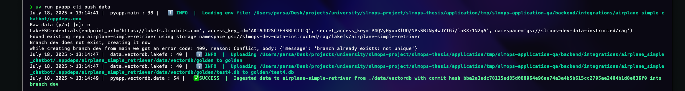<figcaption></figcaption></figure></div>

the resoan is that if now you want to replicate the whole thing it will be a lot easier to do it. and also you can use the same data when cloneing the appstack and it will be automatically there by doing the uv run pyapp-cli run. you can also test this by deleting your raw data and the vectordb data and do the `uv run pyapp-cli run` or `uv run pyapp-cli pull-data` to get the data back.

in order to check that this appstack (airplane_simple_retriever) is working we can use the following command:

```bash
uv run inference
```

this will ask you some questions and then run the inference.

<div data-full-width="true"><figure><figcaption></figcaption></figure></div>

### 2. set up the app stack and application.

you can go back to the application dir and then run below command.
some of the step might take some time be patient.

```bash
cd backend
uv run task run
```

<div data-full-width="true"><figure>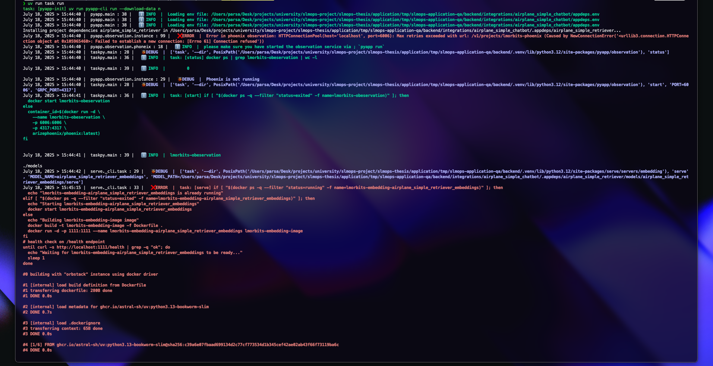<figcaption></figcaption></figure></div>

<div data-full-width="true"><figure>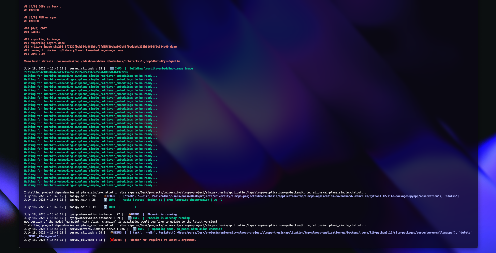<figcaption></figcaption></figure></div>

<div data-full-width="true"><figure>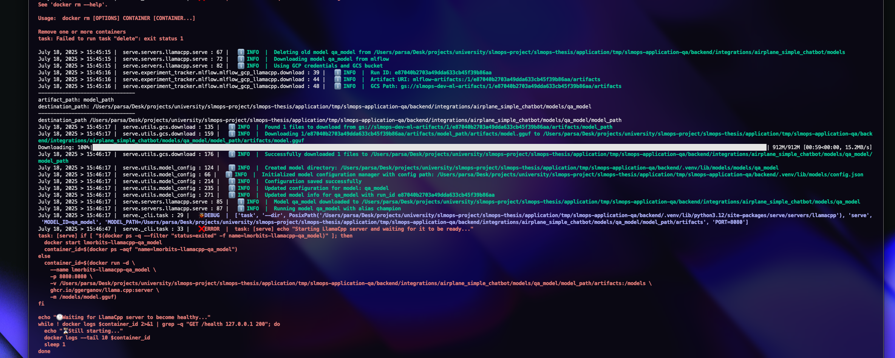<figcaption></figcaption></figure></div>

<div data-full-width="true"><figure>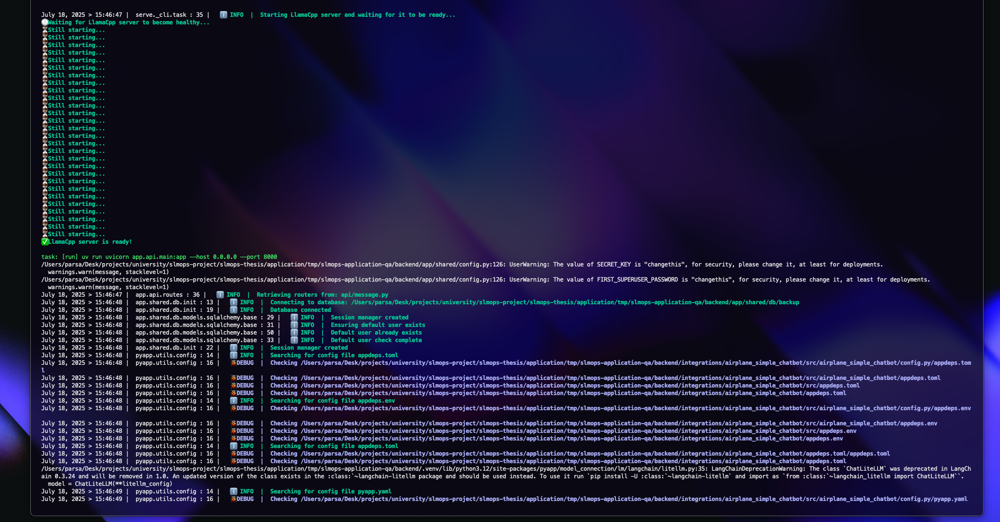<figcaption></figcaption></figure></div>

<div data-full-width="true"><figure>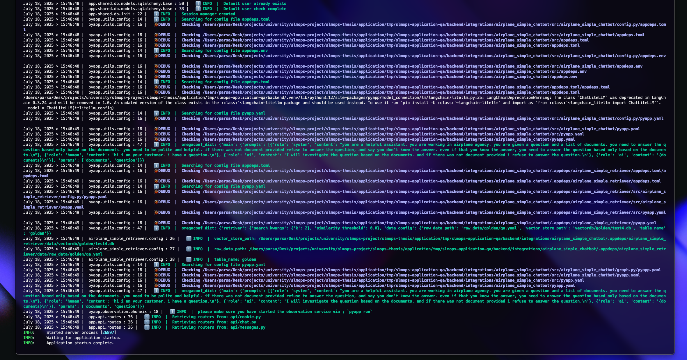<figcaption></figcaption></figure></div>

as you can see now we have 3 docker containers running. one for observability, one for the embeeding model (e.i. the embedding model for the airplane_simple_retriever) and one for the llm model (e.i. the llm model for the airplane_simple_chatbot).

<div data-full-width="true"><figure>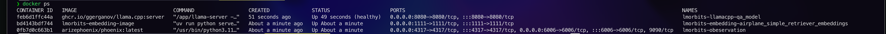<figcaption></figcaption></figure></div>

now go to "http://localhost:8000" and you should see the application running.
you will see the following page:

<div data-full-width="true"><figure>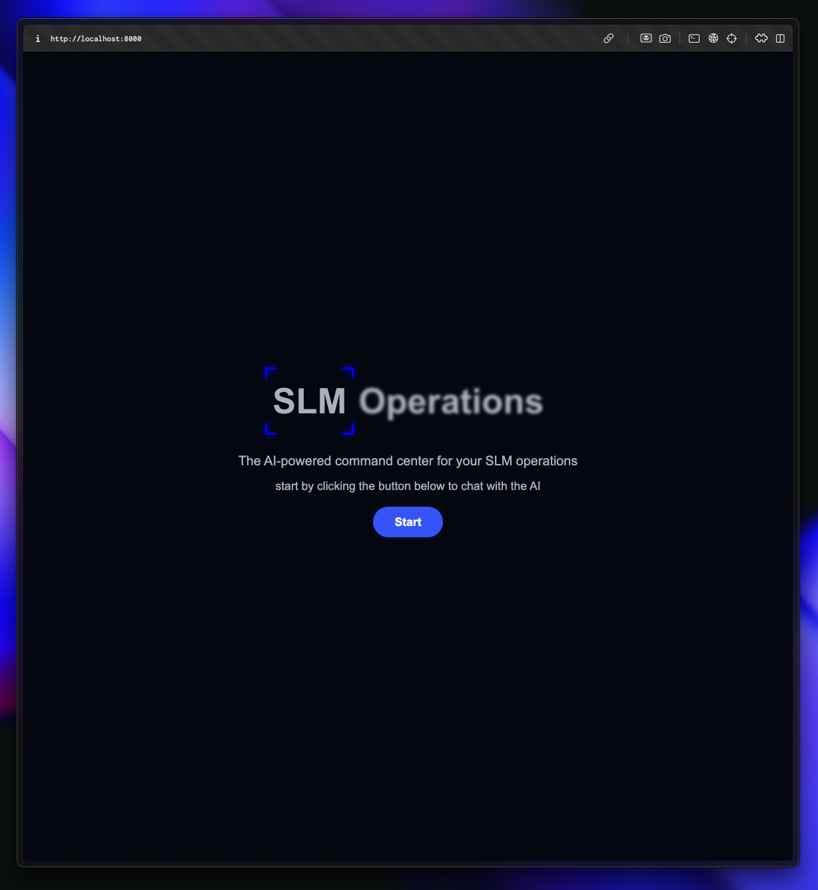<figcaption></figcaption></figure></div>

after clicking the start it might require you to login. and the login code is any number for now.

<div data-full-width="true"><figure>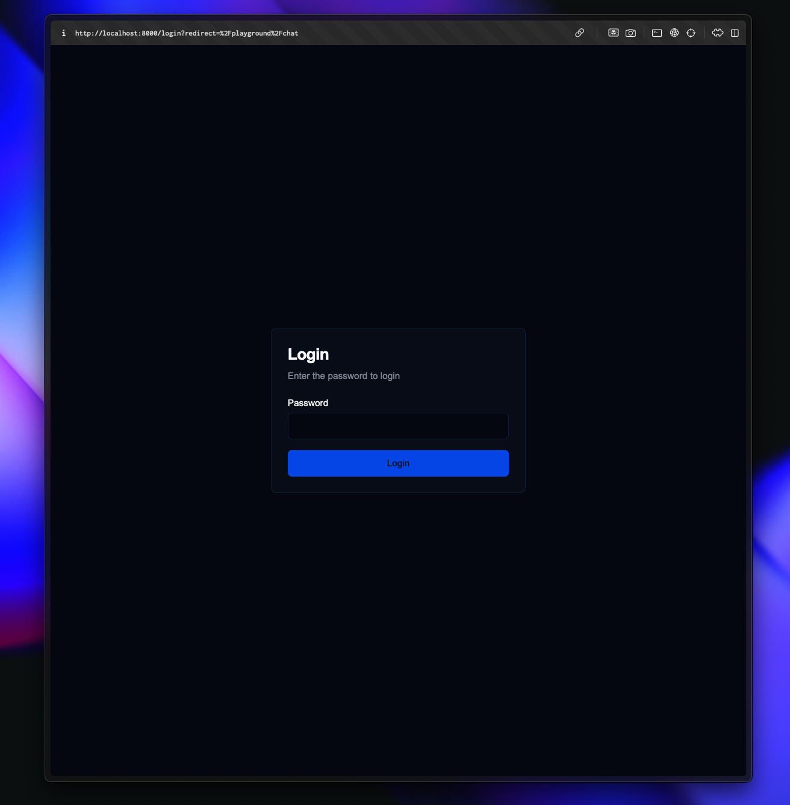<figcaption></figcaption></figure></div>

now you can ask questions to the chatbot.

<div data-full-width="true"><figure>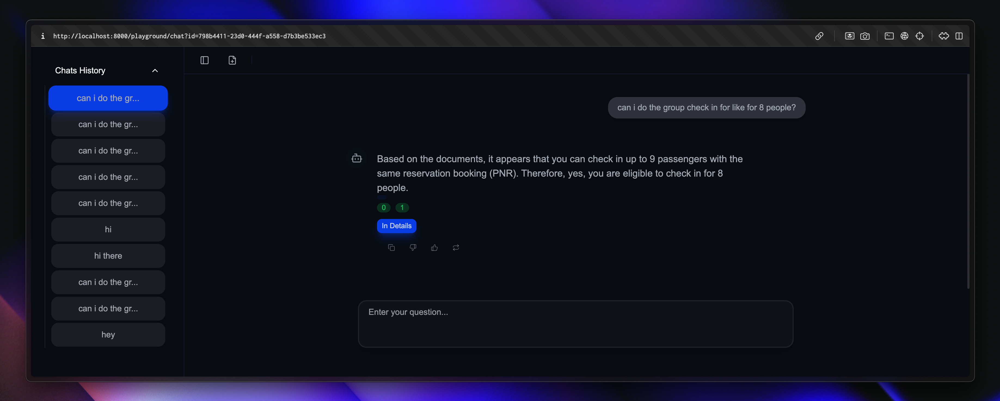<figcaption></figcaption></figure></div>

also on the left you can have the history and by clicking on the green button you can get the link that the answer have used to answer the question.

<div data-full-width="true"><figure>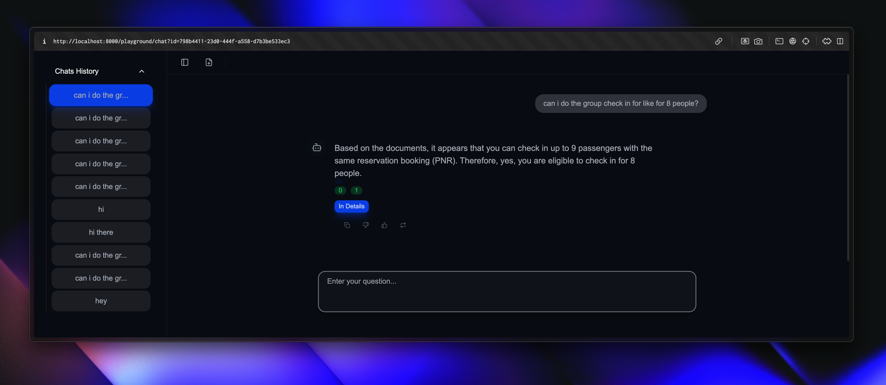<figcaption></figcaption></figure></div>
By clicking on the blue button, you can view the processing steps that occurred to generate the answer. This shows how the appstack components (airplane_simple_retriever and airplane_simple_chatbot) worked together to process your question and provide a response.

<div data-full-width="true"><figure>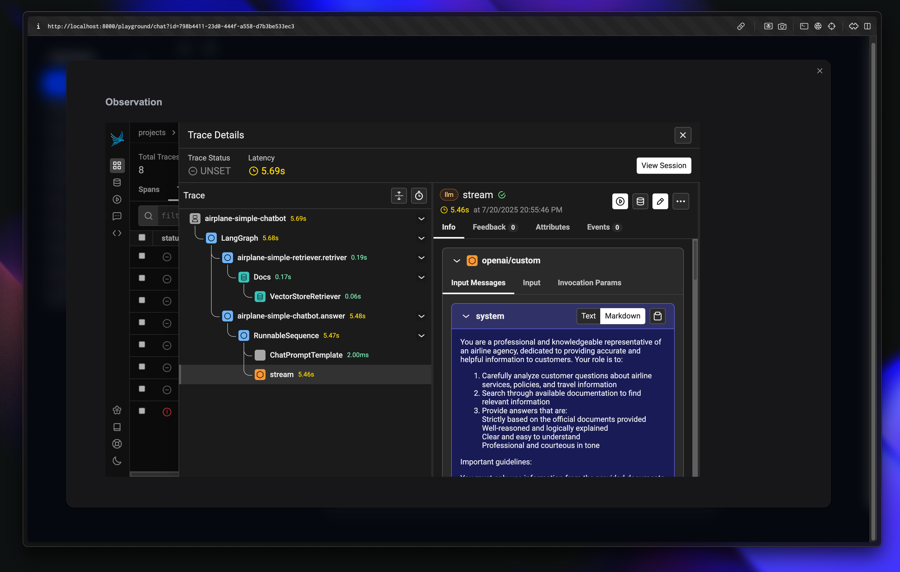<figcaption></figcaption></figure></div>

now if you want to stop all the dockers (observability, embedding model, llm model) you can use the following command:

```bash
uv run task stop
```

this will stop all the dockers(observability, embedding model, llm model).

<div data-full-width="true"><figure>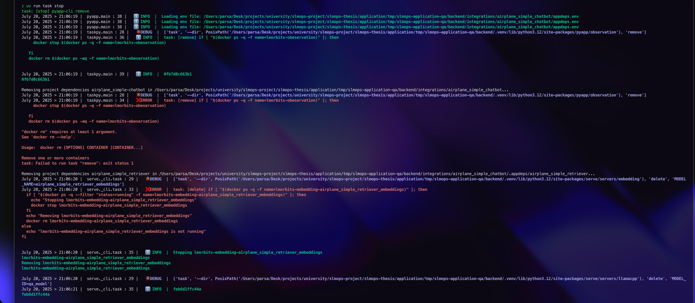<figcaption></figcaption></figure></div>
