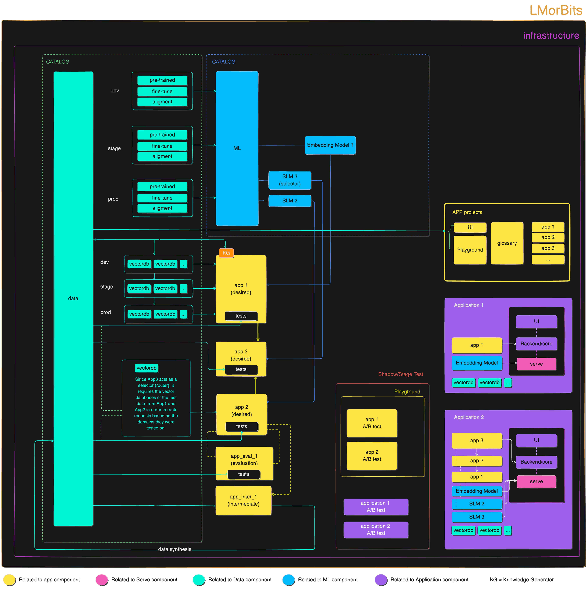

# Introduction

LMOrbits is a [github organization](https://github.com/LMOrbits) for building and deploying small language models. It is a collection of packages for building and deploying small language models. It is designed to be a simple and easy to use platform for building and deploying small language models. it is based on the thesis of [Parsa Mir](https://github.com/Parsa-Mir). as you can see from the picture below it consisit of 5 main parts:

- [app](https://github.com/LMOrbits/app): this is the app package that is responsible for creating app stacks.
- [data](https://github.com/LMOrbits/data): this is the data package that supports the data component of the slmops.
- [ml](https://github.com/LMOrbits/lmorbits): this is the ml package that supports the ml component of the slmops.
- [orchestration](https://github.com/LMOrbits/lmorbits): this is the orchestration package that supports the orchestration component of the slmops.
- [serve](https://github.com/LMOrbits/serve): this is the serve package that supports the serve component of the slmops.
- [infra](https://github.com/LMOrbits/slmops_infra): this is the infra package that supports the infra component of the slmops.

## Maturity Levels

Depending on your use case and level of maturity you can choose to use the following options:

1. starting from simple app stack to build a simple app and application on top of it with openly available llm and embedding models.

   - [app](https://github.com/LMOrbits/app)

2. utilizing the data package to improve the performance of the app stack by using the data component of the slmops. utilizing the Rag system with the capabilities of versioing those to improve the performance of the app stack.

   - [app](https://github.com/LMOrbits/app)
   - [data](https://github.com/LMOrbits/data)
   - [infra](https://github.com/LMOrbits/slmops_infra)

3. focusing much more on the app stack by scaling the app stacks from one to several app stack and bouding all with test data and setting different types such as intemidiate app and red team apps that helps you to synthesis test data and evaluation apps for validating the app stack.

   - [app](https://github.com/LMOrbits/app)
   - [data](https://github.com/LMOrbits/data)
   - [infra](https://github.com/LMOrbits/slmops_infra)

4. utilizing the ml package to train a model on a specific task and then using the serve package to serve the model.

   - [app](https://github.com/LMOrbits/app)
   - [data](https://github.com/LMOrbits/data)
   - [ml](https://github.com/LMOrbits/lmorbits)
   - [orchestration](https://github.com/LMOrbits/lmorbits)
   - [serve](https://github.com/LMOrbits/serve)
   - [infra](https://github.com/LMOrbits/slmops_infra)

5. utilizing the app project and ci/cd to build a full pipeline for building and deploying a model.

   - not implemented yet.

### getting started

we recommend to start from maturity level 1 and then move to the next level as you need.
in order to get started we recommend to follow the procedures for each component seperately in this documentation.
